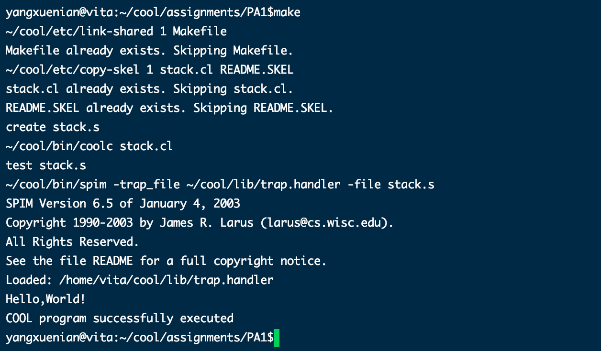
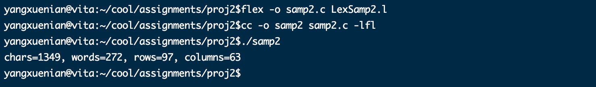
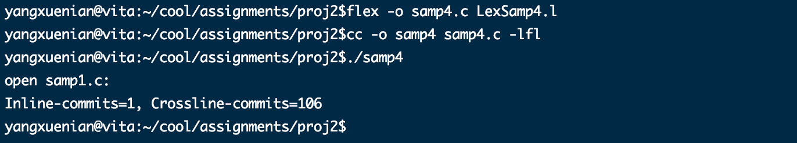
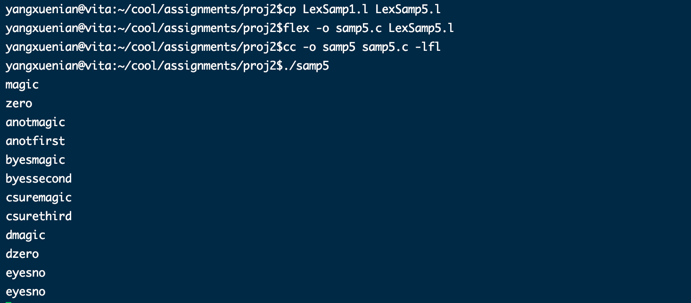
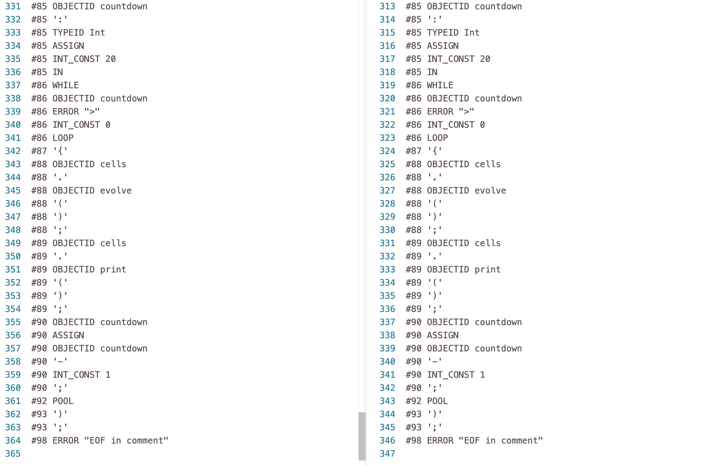
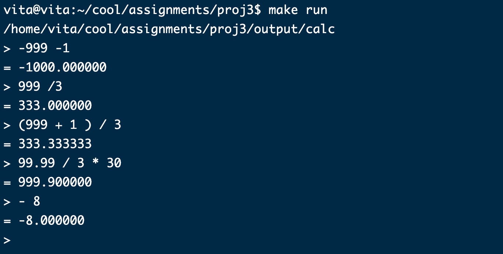

# README

> I don't know why nobody told you
>
> How to unfold your love
>
> I don't know how someone controlled you
>
> They bought and sold you
>
> —— While My Guitar Gently Weeps

希望大家好好学习，不要像我一样在DDL前一天晚上赶工。

---------------

环境配置
========

1.  修改终端提示符；

2.  安装flex和bison;

3.  理解Cool目录下的文件;

4.  编译hello world程序。

修改终端提示符
--------------

使用方法1会对用户名进行永久的修改，使用方法2是临时修改。

安装flex和bison
---------------

编译hello world程序
-------------------

**stack.cl**内容:

    class Main inherits IO
    {
       main():SELF_TYPE
       {
          {
             out_string("Hello,World!\n");
          }
       };
    };

熟悉cool编程
============

1.  阅读资料，编写stack.cl,满足堆栈机；

2.  （附加）使用2个以上的.cl文件，修改makefile达到同样目的；

3.  （附加）重写stack.cl。放弃原先skelon骨架，放弃let的表达式使用方式；

4.  （附加）使用cool编写斐波那契数列或者其他程序。

编写stack.cl,满足堆栈机
-----------------------

**demo.cl**部分内容

    class Main inherits IO
    {
        stack : List;
        
        newline() : Object
        {
            out_string("\n")
        };
        
        prompt() : String
        {
            {
                out_string(">");
                in_string();
            }
        };
        
        display_stack(s : List) : Object
        {
            {
                --out_string("hello\n");
                if s.isNil() then out_string("")
                        else
                        {
                            out_string(s.head());
                            out_string("\n");
                            display_stack(s.tail());
                        }
            fi;
            }
        };
        
        main():Object
        {
            ( let z : A2I <- new A2I  , stack : List <- new List in
                while true loop
                ( let s : String <- prompt() in
                    if s = "x" then
                        abort()
                    else
                        if s = "d"  then
                            display_stack(stack)
                        else
                            if s = "e"  then
                                {
                                    if stack.isNil() then out_string("")
                                    
                                    else
                                    if stack.head() = "+" then
                                        {
                                            stack <- stack.tail();
                                            (let a : Int <- new Int, b : Int <- new Int in  
                                                {
                                                    --out_string(stack.head());
                                                    a  <- z.a2i(stack.head());
                                                    stack <- stack.tail();
                                                    b  <- z.a2i(stack.head());
                                                    stack <- stack.tail();
                                                    a <- a + b;
                                                    --out_string(z.i2a(a));
                                                    stack <- stack.cons(z.i2a(a));
                                                }
                                            );
                                        }
                                    else
                                        if stack.head() = "s" then
                                            {
                                                stack <- stack.tail();
                                                (let a : String <- new String , b : String <- new String in 
                                                    {
                                                        a  <- stack.head();
                                                        stack <- stack.tail();
                                                        b  <- stack.head();
                                                        stack <- stack.tail();
                                                        stack <- stack.cons(a);
                                                        stack <- stack.cons(b);
                                                    }
                                                );
                                            }
                                        else
                                            out_string("")
                                        fi
                                        fi
                                    fi;
                                }
                            else
                                stack <- stack.cons(s)
                            fi
                        fi
                    fi
                )
                pool
            )
        };
    };

使用cool编写斐波那契数列或者其他程序。
--------------------------------------

    class Main inherits IO {
    
        num :Int;
        x : Int <- 1;
    
        prompt() : Int
        {
            {
                out_string(">");
                in_int();
            }
        };

        main() : SELF_TYPE {
        {
            out_string("Enter Number:\n");
            num  <- prompt();
            out_string("The Fibonacci sequence of ");
            out_int(num);
            out_string(" is:\n");
    
            while x < num+1 loop
                        { 
                            out_int(func(x));
                            out_string("\n");
                            x <- x +1;
                        }
                        pool;
            self;
        }
        };
    
    func(n:Int) : Int {
        {
            let sum:Int <- 0 in {
                if n = 1 then sum <- 1 else 
                if n = 2 then sum <- 1 else
                sum <- func(n-1)+func(n-2)
                fi fi;
                sum;
                };
        }
        
    };
    
    };

词法分析 上
===========

1.  熟悉Flex

    1.  实现打印输入文字的行数，列数和字数；

    2.  实现统计给定程序文件的行数，列数和字数；

    3.  实现统计给定程序的字数，如统计一个程序中if的个数；

    4.  实现C/C++ 块/行注释的处理。

2.  多重入口

    1.  实现多重入口。

实现打印输入文字的行数，列数和字数
----------------------------------

    %{
    #include <stdio.h>
    int chars, words, rows,maxColumn=0,columns; /* 分别记录字符个数、字数和行数 */
    %}
    %option yylineno
    %%
    [ \t]                  
    \n         {
                 rows++;
                 if(maxColumn<columns){
                    maxColumn=columns;
                 }
                 columns=0;
               } 
    [^ \t\n]+  {
                 words++;
                 chars+=yyleng;
                 columns+=yyleng;
                }
    %%
    int main()
    { 
       printf("Press CTRL+d to quit.\nInput any text:\n");
       yylex();             /* 调用词法分析器，直到输入结束  */
       printf("chars=%d, words=%d, rows=%d, columns=%d\n", chars, words, rows ,maxColumn);
       return 0;
    }
    // int yywrap(){ return 1; }

统计给定程序文件的行数，列数和字数
----------------------------------

    %{
    #include <stdio.h>
    int chars, words, rows,maxColumn=0,columns;
    %}
    %option yylineno
    %%
    [ \t]                  
    \n         {
                 rows++;
                 if(maxColumn<columns){
                    maxColumn=columns;
                 }
                 columns=0;
               } 
    [^ \t\n]+  {
                 words++;
                 chars+=yyleng;
                 columns+=yyleng;
                }
    %%
    int main()
    {
        yyin=fopen("test.cl","r");
        yylex();
        printf("chars=%d, words=%d, rows=%d, columns=%d\n", chars, words, rows ,maxColumn);
       return 0;
    }

统计给定程序的字数，如统计一个程序中if的个数
--------------------------------------------

    %{
    #include <stdio.h>
    int nif; /* 记录if个数 */
    %}
    %option yylineno
    %%
    [ \t]                /* “吃”掉它们 */
    \n                   /* “吃”掉它们 */
    [^ \t\n]+            /* “吃”掉它们 */
    [ (][i][f][ ]  {++nif; }  /* 匹配到if，数字加1 */
    %%
    int main()
    { 
       yyin=fopen("test.cl","r");
       yylex();             /* 调用词法分析器，直到输入结束  */
       printf("ifs=%d\n", nif);
       return 0;
    }

实现C/C++ 块/行注释的处理
-------------------------

    %{
    #include <stdio.h>
    int commitsInline,commitsCrossline; /* 记录注释数 */
    %}
    %option yylineno
    %%
    \/\*(\s|.)*?\*\/   {
                            commitsCrossline++;
                         }
    \/\/               {
                            commitsInline++;
                         }
    [ \t]                /* “吃”掉它们 */
    \n                   /* “吃”掉它们 */
    [^ \t\n]+            /* “吃”掉它们 */
    %%
    int main()
    { 
       yyin=fopen("samp1.c","r");
       yylex();             /* 调用词法分析器，直到输入结束  */
       printf("open samp1.c:\nInline-commits=%d, Crossline-commits=%d\n", commitsInline,commitsCrossline);
       return 0;
    }

实现多重入口
------------

    %{
    /* 功能：
     * 将输入复制到输出，同时对输入文本中的字符序列“magic”做变换：
     *  (1) 若行首以字母a开始，则将紧跟其后的第1个序列"magic"变化为"first"输出;
     *  (2) 若行首以字母b开始，则将紧跟其后的第1个序列"magic"变化为"second"输出;
     *  (3) 若行首以字母c开始，则将紧跟其后的第1个序列"magic"变化为"third"输出;
     *  (4) 其他地方出现的序列"magic"变化为"zero"输出;
     *  (5) 其他行和非magic单词不变，直接输出。
     */
    
    #include <stdio.h>
    %}
    %start AA BB CC
    %%
    ^a          { ECHO; BEGIN AA; }
    ^b          { ECHO; BEGIN BB; }
    ^c          { ECHO; BEGIN CC; }
     /*注释不能顶头 */
    \n|(\t)+|" "+   { ECHO; BEGIN 0; }
     /**/
     /* 如果这个规则位于所有<?>magic之前，则
      * <?>magic规则永远无法起作用
      *
    magic       { printf ("zero");}
     */
    <AA>magic       { printf("first"); }
    <BB>magic       { printf("second");}
    <CC>magic       { printf("third");}
     /* 该规则必须放到上三条之后，原因见上 */
    magic       { printf ("zero");}
     /* */
    %%
    
    /*以上语义动作没有return语句，所以yylex()仅遇到
     * 输入结束才返回。
     */
    int main()
    {
       int a;
       a = yylex();
       return 0;
    }
    
    int yywrap() { return 1; }  

词法分析 下
===========

修改cool.flex,填写辅助定义部分和代码部分，依次用生成的lexer和标准的reference-lexer编译样例.cl文件，对比生成的结果是否一样.

参考：

1.  查看include/PA2目录下的Cool-parse.h,查看有哪些记号需要添加；

2.  查看同文件夹下stringtab.h,查看节点基本类型和符号表；

3.  查看cool.flex。

cool.flex
---------

语法分析 上
===========

1.  编写.y文件 实现一个简单的一位数计算器，包括减法和乘法；

2.  在上面的基础上增加加法和除法，并能识别负数；

3.  在上面的基础上实现多位数字的处理，并增加报错；

4.  在上面的基础上使用.l文件完成词法分析识别数字，并实现浮点数处理功能；

5.  编写一个.y文件，根据cool的标准文法，完成语法分析并生成语法分析树；

6.  在cool.y文件里修改let操作或者只完成let操作。

实验1～4内容及结果
------------------

综合实验1～4的要求，完成了具有多位数处理、负数识别、加减乘除运算、括号处理、浮点数处理的计算器。

    /* calc.l */
    /* recognize tokens for the calculator and print them out */
    
    %{
    # include "calc.tab.h"
    extern int yyerror(const char *, ...);
    %}
    
    %%
    "+" { return ADD;  }
    "-" { return SUB;  }
    "*" { return MUL;  }
    "/" { return DIV;  }
    "(" { return OP;  }
    ")" { return CP;  }
    ([1-9][0-9]*)|0|([0-9]+\.[0-9]+) {
        double temp;
        sscanf(yytext, "%lf", &temp);
        yylval.double_value = temp;
        return DOUBLE_NUMBER;
    }

    \n      { return EOL;  }
    "//".*  
    [ \t ]   { /* ignore white space */  }
    .   { yyerror("Mystery character %c\n", *yytext);  }
    %%
    
    /* calc.y */
    /* simplest version of calculator */
    
    %{
    #include <stdarg.h>
    #include <stdio.h>
    int yyerror(const char *, ...);
    extern int yylex();
    extern int yyparse();
    %}
    /* declare tokens */
    %union {
        int int_value;
        double double_value;
    }
    %token <double_value> DOUBLE_NUMBER
    %token ADD SUB MUL DIV
    %token OP CP
    %token EOL
    %type <double_value> exp factor term
    %%
    
    calclist: /* nothing */
            | calclist exp EOL { printf("= %lf\n> ", $2);  }
        | calclist EOL { printf("> ");  } /* blank line or a comment */
    ;
    
    exp: factor
           | exp ADD factor { $$ = $1 + $3;  }
        | exp SUB factor { $$ = $1 - $3;  }
    ;
    
    factor: term
            | factor MUL term { $$ = $1 * $3;  }
        | factor DIV term { $$ = $1 / $3;  }
    ;
    
    term: SUB DOUBLE_NUMBER { $$ = -$2; }
            | DOUBLE_NUMBER
        | OP exp CP { $$ = $2;  }
    ;
    %%
    
    int main()
    {
        printf("> "); 
        yyparse();
        return 0;
    
    }
    
    int yyerror(const char *s, ...)
    {
        int ret;
        va_list va;
        va_start(va, s);
        ret = vfprintf(stderr, s, va);
        va_end(va);
        return ret;
    
    }

语法分析 下
===========

完成布尔表达式的求值。

1.  输入以true/false组成的布尔表达式;

2.  分析表达式语法关系，求值。

    /* calc.l */
    /* recognize tokens for the calculator and print them out */
    
    %{
    # include "calc.tab.h"
    extern int yyerror(const char *, ...);
    %}
    
    %%
    "true"  { return TRUE;  }
    "false"  { return FALSE;  }
    "||" {return OR; }
    "&&" {return AND; }
    "!" {return NOT; }
    "(" { return OP;  }
    ")" { return CP;  }
    \n      { return EOL;  }
    "//".*  
    [ \t ]   { /* ignore white space */  }
    .   { yyerror("Mystery character %c\n", *yytext);  }
    %%
    
    /* calc.y */
    /* simplest version of calculator */
    
    %{
    #include <stdarg.h>
    #include <stdio.h>
    int yyerror(const char *, ...);
    extern int yylex();
    extern int yyparse();
    %}
    %union {
        int bool_value;
    }
    /* declare tokens */
    %token TRUE FALSE
    %token OR AND NOT
    %token OP CP
    %token EOL
    %type <bool_value> exp factor term
    %%
    
    calclist: /* nothing */
            | calclist exp EOL { printf("= %d\n> ", $2);  }
        | calclist EOL { printf("> ");  } /* blank line or a comment */
    ;
    
    exp: factor
           | exp OR factor { $$ = $1 || $3;  }
        | exp AND factor { $$ = $1 && $3;  }
    ;
    
    factor: NOT term { $$ =  !$2;  }
            | term { $$ = $1;  }
    ;
    
    term: OP exp CP { $$ = $2;  }
        | TRUE  { $$ = 1; }
        | FALSE  { $$ = 0; }
    ;
    %%
    
    int main()
    {
        printf("> "); 
        yyparse();
        return 0;
    
    }
    
    int yyerror(const char *s, ...)
    {
        int ret;
        va_list va;
        va_start(va, s);
        ret = vfprintf(stderr, s, va);
        va_end(va);
        return ret;
    
    }
