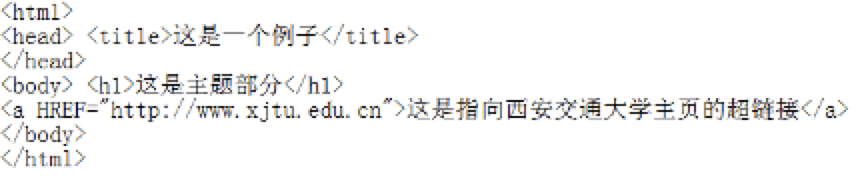
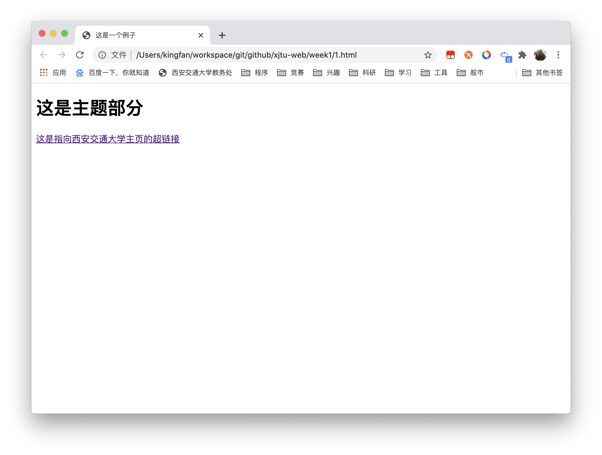
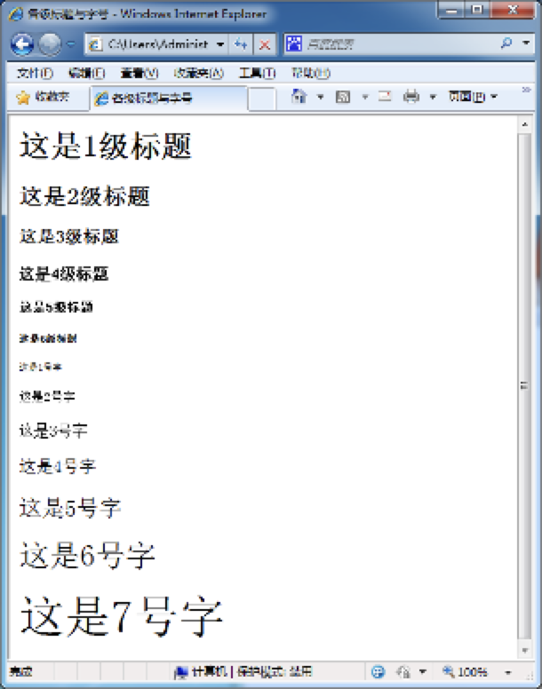
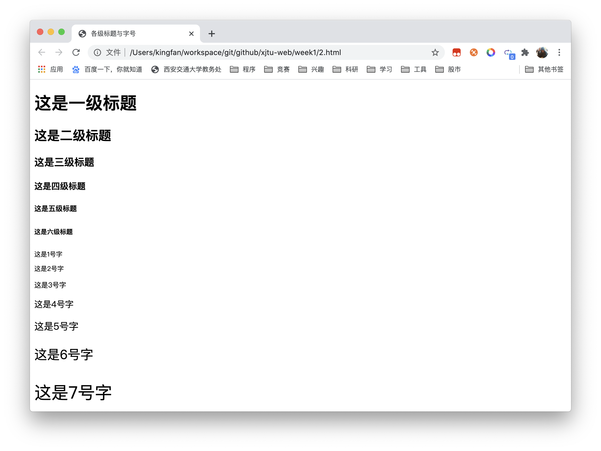
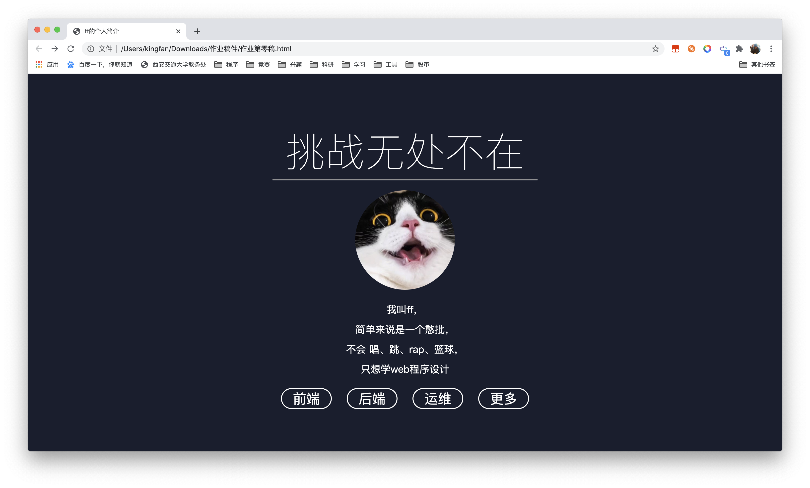
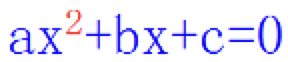
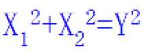
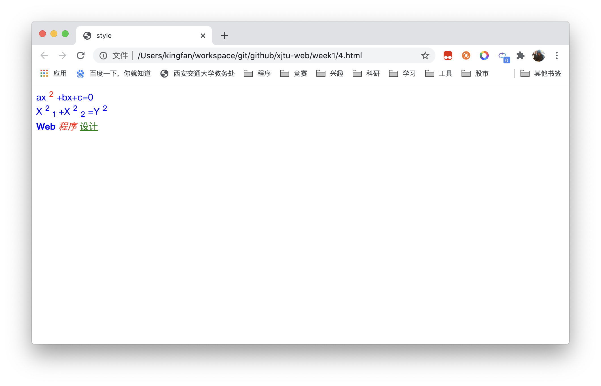

# 《Web程序设计》第一次上机作业

### 第一题

> 在记事本中输入下面的内容，保存为网页，然后在浏览器中运行该网页




> 请程序代码填写到本处，并给出该程序的运行结果

- 程序代码

```html
<!DOCTYPE html>
<html lang="zh"> 
<!-- i18n设置为简体中文 -->
<head>
  <meta charset="UTF-8">
  <!-- 编码默认为UTF-8 -->
  <meta name="viewport" content="width=device-width, initial-scale=1.0">
  <!-- 设置默认视图以优化移动端显示 -->
  <title>这是一个例子</title>
</head>
<body>
  <h1>这时主题部分</h1>
  <a href="http://www.xjtu.edu.cn/">这是指向西安交通大学主页的超链接</a>
</body>
</html>
```

- 运行结果



### 第二题

> 创建网页，要求显示下面的结果



> 请程序代码填写到本处，并给出该程序的运行结果

- 程序代码

```html
<!DOCTYPE html>
<html lang="zh">
<head>
  <meta charset="UTF-8">
  <meta name="viewport" content="width=device-width, initial-scale=1.0">
  <!-- 上述代码已说明过用途不再赘述 -->
  <title>各级标题与字号</title>
</head>
<body>
  <h1>这是一级标题</h1>
  <h2>这是二级标题</h2>
  <h3>这是三级标题</h3>
  <h4>这是四级标题</h4>
  <h5>这是五级标题</h5>
  <h6>这是六级标题</h6>
  <!-- 在HTML4以后，font标签已不再被赞成使用，因此使用font样式代替 -->
  <p style="font-size: xx-small;">这是1号字</p>
  <p style="font-size: x-small;">这是2号字</p>
  <p style="font-size: small;">这是3号字</p>
  <p style="font-size: medium;">这是4号字</p>
  <p style="font-size: large;">这是5号字</p>
  <p style="font-size: x-large;">这是6号字</p>
  <p style="font-size: xx-large;">这是7号字</p>
</body>
</html>
```

- 运行结果



- 代码说明
  - 在HTML4以后，font标签已不再被赞成使用，因此使用font样式代替，见https://www.w3school.com.cn/tags/tag_font.asp
  - h,p标签为行级元素，不需要换行符

### 第三题

> 创建一个网页，要求网页标题是“个人简介”，网页内容自定义，要求文字中不同设置不同的字体、颜色和字号

> 请程序代码填写到本处，并给出该程序的运行结果

- 程序代码

```html
<html>

<head>
  <title>ff的个人简介</title>
  <style>
    * {
      padding: 0;
      margin: 0;
    }

    a {
      text-decoration: none;
      color: #ffffff;
    }

    body {
      background-color: #272f47;
      background-color: #1a1e2e;
      color: #ffffff;
      text-align: center
    }

    .title {
      margin-top: 100px;
      font-size: 80px;
      font-weight: lighter;
    }

    .photo {
      height: 200px;
      border-radius: 50%;
      margin: 20px;
    }

    .line {
      width: 530px;
      margin: auto;
    }

    .txt {
      width: 530px;
      margin: auto;
      font-size: 20px;
      line-height: 40px;
    }

    .bottoms {
      margin: 20px;
    }

    .border {
      padding: 0 22px;
      margin: 15px;
      font-size: 27px;
      border: 2px solid;
      border-radius: 30px;
    }
  </style>
</head>

<body>

  <h1 class="title">挑战无处不在</h1>
  <hr class="line" />
  
  <div class="txt">
    <p>我叫ff，</p>
    <p>简单来说是一个憨批，</p>
    <p>不会 唱、跳、rap、篮球，</p>
    <p>只想学web程序设计</p>
  </div>
  <div class="bottoms">
    <a href="https://www.tiaozhan.com/" class="border">前端</a>
    <a href="https://www.tiaozhan.com/" class="border">后端</a>
    <a href="https://www.tiaozhan.com/" class="border">运维</a>
    <a href="https://www.tiaozhan.com/" class="border">更多</a>
  </div>

</body>

</html>
```

- 运行结果



### 第四题

> 创建网页，要求网页中包含以下的内容：（两个公式，文字的加粗、倾斜和下划线）






> 请程序代码填写到本处，并给出该程序的运行结果

- 程序代码

```html
<!DOCTYPE html>
<html lang="zh">
<head>
  <meta charset="UTF-8">
  <meta name="viewport" content="width=device-width, initial-scale=1.0">
  <title>style</title>
</head>
<style>
  div{
    color: blue;
  }
  body > div:first-child > sup {
    color: red;
  }
  body > div:last-child > span:first-child {
    font-weight: bold;
  }
  body > div:last-child > span:nth-child(2) {
    font-style: italic;
    color: red;
  }
  body > div:last-child > span:last-child {
    text-decoration: underline;
    color: green;
  }
</style>
<body>
  <div>
    <span>ax</span>
    <sup>2</sup>
    <span>+bx+c=0</span>
  </div>
  <div>
    <span>X</span>
    <sup>2</sup>
    <sub>1</sub>
    <span>+X</span>
    <sup>2</sup>
    <sub>2</sub>
    <span>=Y</span>
    <sup>2</sup>
  </div>
  <div>
    <span>Web</span>
    <span>程序</span>
    <span>设计</span>
  </div>
</body>
</html>
```

- 运行结果


