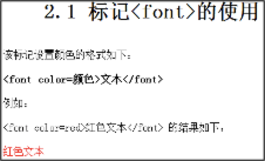
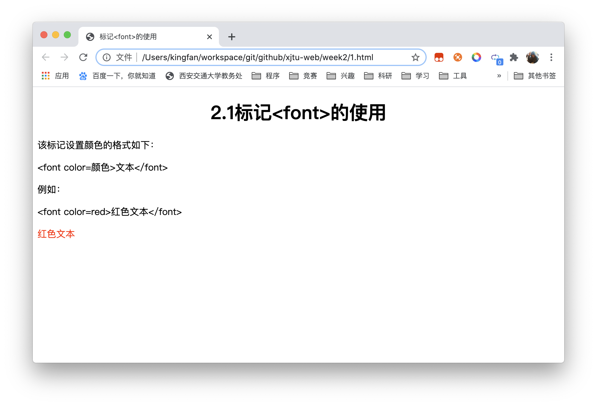
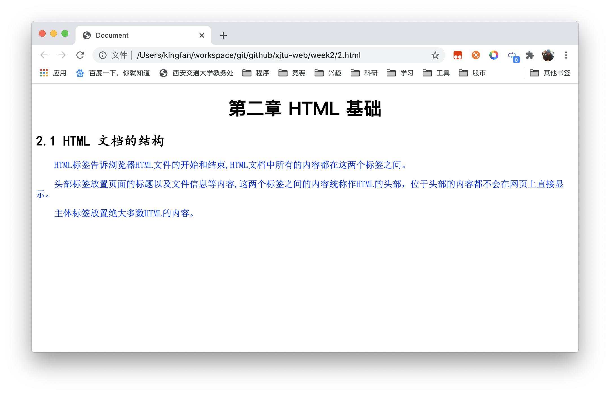
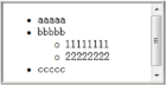
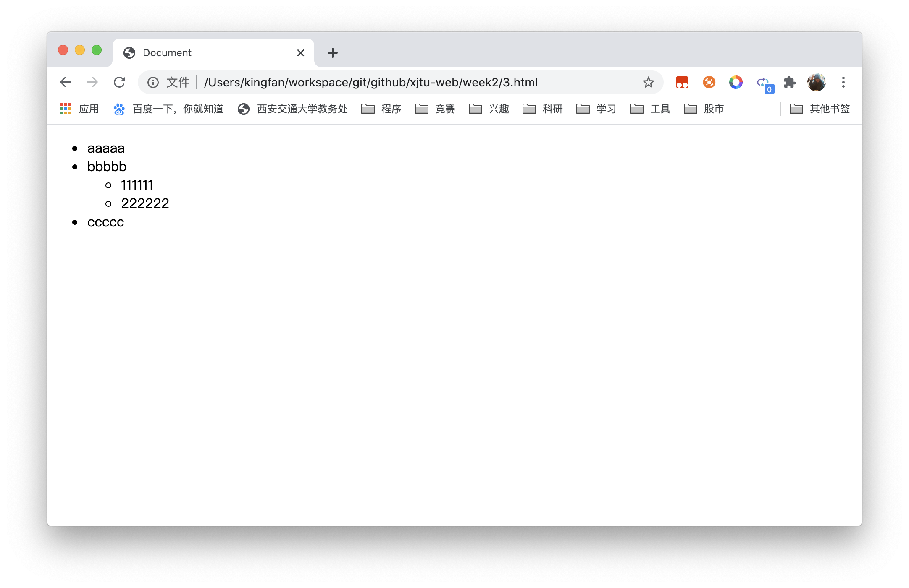
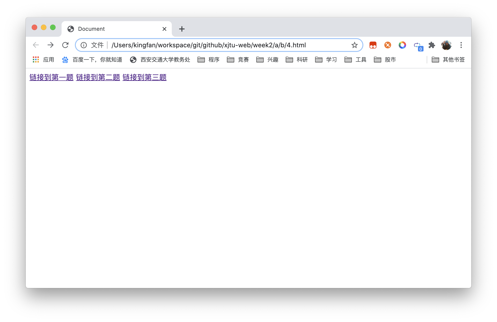

# 《Web程序设计》第2次上机作业


## 创建网页，要求在浏览器中显示下面的结果



- 程序代码

```html
<!DOCTYPE html>
<html lang="zh">

<head>
  <meta charset="UTF-8">
  <meta name="viewport" content="width=device-width, initial-scale=1.0">
  <title>标记<font>的使用</title>
</head>

<body>
  <h1 style="text-align: center;">2.1标记&lt;font&gt;的使用</h1>
  <p>该标记设置颜色的格式如下：</p>
  <p>&lt;font color=颜色&gt;文本&lt;/font&gt;</p>
  <p>例如：</p>
  <p>&lt;font color=red&gt;红色文本&lt;/font&gt;</p>
  <p style="color: red;">红色文本</p>
</body>

</html>
```

- 运行截图



- 代码说明
  - 在HTML4以后，font标签已不再被赞成使用，因此使用font样式代替，见https://www.w3school.com.cn/tags/tag_font.asp

## 创建网页，网页中的内容如下，可以粘贴到记事本上

> 第二章 HTML 基础
>
> 2.1 HTML 文档的结构
>
> HTML标签告诉浏览器HTML文件的开始和结束,HTML文档中所有的内容都在这两个标签之间。
>
> 头部标签放置页面的标题以及文件信息等内容,这两个标签之间的内容统称作HTML的头部，位于头部的内容都不会在网页上直接显示。
>
> 主体标签放置绝大多数HTML的内容。

**要求设置的网页格式如下**

- 章为标题h1，居中，黑体，红色
- 节为标题h2，居左，楷体，绿色
- 正文有三段，设置为宋体，蓝色


- 程序代码

```html
<!DOCTYPE html>
<html lang="zh">

<head>
  <meta charset="UTF-8">
  <meta name="viewport" content="width=device-width, initial-scale=1.0">
  <title>Document</title>
</head>
<style>
  p {
    font-family: SimSun;
    color: blue;
    text-indent: 2em;
  }
</style>

<body>
  <h1 style="text-align: center;font-family: SimHei;">第二章 HTML 基础</h1>
  <h2 style="font-family: KaiTi;">2.1 HTML 文档的结构</h2>
  <p>HTML标签告诉浏览器HTML文件的开始和结束,HTML文档中所有的内容都在这两个标签之间。</p>
  <p>头部标签放置页面的标题以及文件信息等内容,这两个标签之间的内容统称作HTML的头部，位于头部的内容都不会在网页上直接显示。</p>
  <p>主体标签放置绝大多数HTML的内容。</p>
</body>

</html>
```

- 运行截图



## 创建一个网页，网页中包含列表的嵌套，在浏览器中显示下面的结果



- 程序代码

```html
<!DOCTYPE html>
<html lang="zh">

<head>
  <meta charset="UTF-8">
  <meta name="viewport" content="width=device-width, initial-scale=1.0">
  <title>Document</title>
</head>

<body>
  <ul>
    <li>aaaaa</li>
    <li>bbbbb</li>
    <ul>
      <li>111111</li>
      <li>222222</li>
    </ul>
    <li>ccccc</li>
  </ul>
</body>

</html>
```

- 运行截图



## 在网页中创建不同的链接，分别链接到上面创建的三个网页中

1. 在上面创建的文件夹中创建子文件夹a
2. 在文件夹a中创建两个文件夹 b和d
3. 在文件夹b中创建文件夹c
4. 将前三个网页分别移动到文件夹a、d和c中
5. 在文件夹b中创建网页，网页运行结果如下，其中含有三个链接，分别链接到其它三个网页中


- 程序代码

```html
<!DOCTYPE html>
<html lang="zh">

<head>
  <meta charset="UTF-8">
  <meta name="viewport" content="width=device-width, initial-scale=1.0">
  <title>Document</title>
</head>

<body>
  <a href="./../../a/1.html">链接到第一题</a>
  <a href="./../d/2.html">链接到第二题</a>
  <a href="./c/3.html">链接到第三题</a>
</body>

</html>
```

- 运行截图

