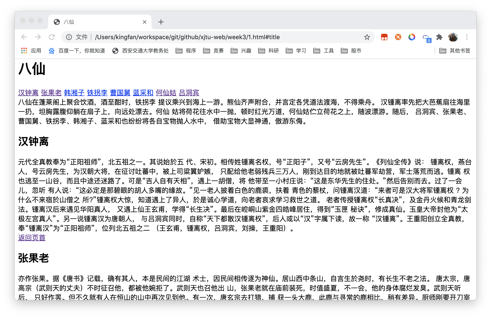
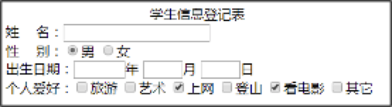
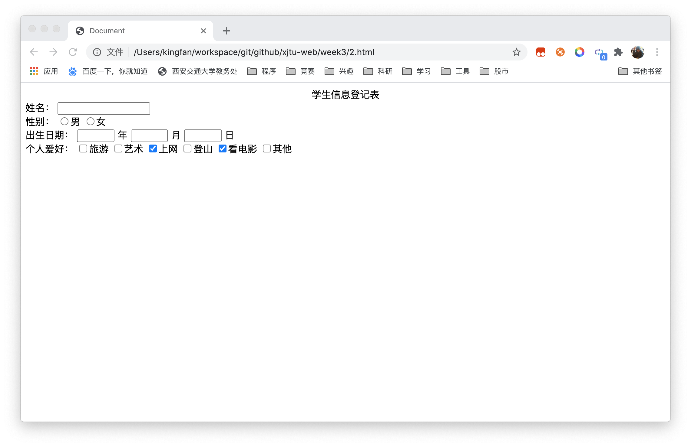
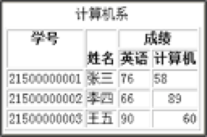
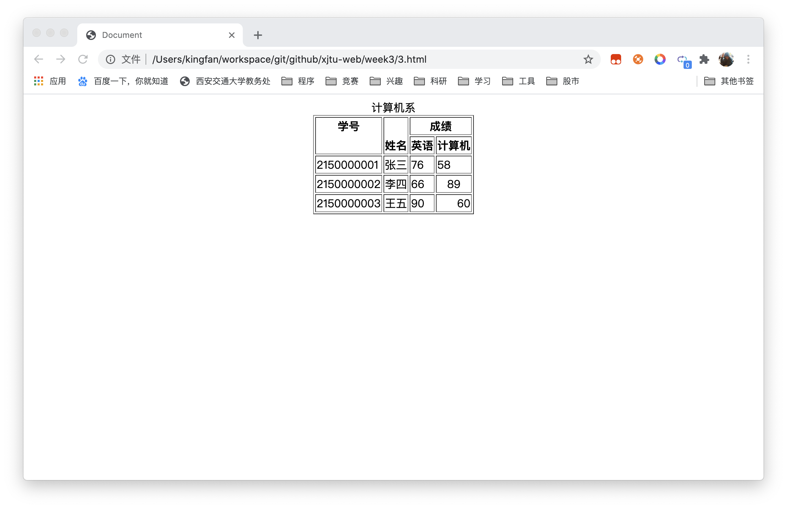
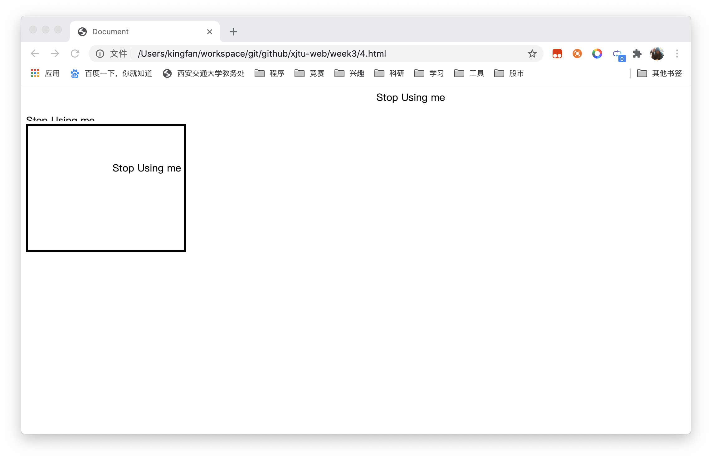

# 《Web程序设计》第3次上机作业

## 创建网页内超链接，网页的内容来自文件“八仙.txt”，要求在浏览器中显示下面的结果

- 在每个人物的介绍部分添加书签
- 为每个人物名字添加超级链接，分别连接到8个人物具体的介绍，样文中只显示了一个链接
- 在文档开始添加书签
- 每个人物介绍的结尾添加链接，名为“返回页首”，单击时返回文档的开始。


- 程序代码

```html
<!DOCTYPE html>
<html lang="zh">
<head>
  <meta charset="UTF-8">
  <meta name="viewport" content="width=device-width, initial-scale=1.0">
  <title>八仙</title>
</head>
<body>
  <h1 id="title">八仙</h1>
  <a href="#1">汉钟离</a>
  <a href="#2">张果老</a>
  <a href="#3">韩湘子</a>
  <a href="#4">铁拐李</a>
  <a href="#5">曹国舅</a>
  <a href="#6">蓝采和</a>
  <a href="#7">何仙姑</a>
  <a href="#8">吕洞宾</a>
  <div>八仙在蓬莱阁上聚会饮酒，酒至酣时，铁拐李 提议乘兴到海上一游。熊仙齐声附合，并言定各凭道法渡海，不得乘舟。 汉锺离率先把大芭蕉扇往海里一扔，坦胸露腹仰躺在扇子上，向远处漂去。何仙 姑将荷花往水中一抛，顿时红光万道，何仙姑伫立荷花之上，随波漂游。随后， 吕洞宾、张果老、曹国舅、铁拐李、韩湘子、蓝采和也纷纷将各自宝物抛人水中， 借助宝物大显神通，傲游东侮。 </div>
  <h2 id="1">汉钟离</h2>
  <div>元代全真教奉为“正阳祖师”，北五祖之一。其说始於五 代、宋初。相传姓锺离名权，号“正阳子”，又号“云房先生”。《列仙全传》说： 锺离权，燕台人，号云房先生，为汉朝大将，在征讨吐蕃中，被上司粱翼妒嫉， 只配给他老弱残兵三万人，刚到达目的地就被吐蕃军劫营，军士落荒而逃。锺离 权也逃至一山谷，而且中途还迷路了。可是“吉人自有天相”，遇上一胡僧，将 他带至一小村庄说：“这是东华先生的住处。”然后告别而去。过了一会儿，忽听 有人说：“这必定是那碧眼的胡人多嘴的缘故。”见一老人披着白色的鹿裘，扶着 青色的藜杖，问锺离汉道：“来者可是汉大将军锺离权 ? 为什么不来宿於山僧之 所?”锺离权大惊，知道遇上了异人，於是诚心学道，向老者哀求学习救世之道。 老者传授锺离权“长真决”，及金丹火候和青龙剑法。锺离汉后来遇见华阳真人， 又遇上仙王玄甫，学得“长生决”。最后在崆峒山紫金四皓峰居住，得到“玉匣 秘诀”，修成真仙。玉皇大帝封他为“太极左宫真人”。另一说锺离汉为唐朝人， 与吕洞宾同时，自称“天下都散汉锺离权”，后人或以“汉”字属下读，故一称 “汉锺离”。王重阳创立全真教，奉“锺离汉”为“正阳祖师”，位列北五祖之二 （王玄甫，锺离权，吕洞宾，刘操，王重阳）。</div>
  <a href="#title">返回页首</a>
  <h2 id="2">张果老</h2>
  <div>亦作张果。据《唐书》记载，确有其人，本是民间的江湖 术士，因民间相传逐为神仙。居山西中条山，自言生於尧时，有长生不老之法。 唐太宗，唐高宗（武则天的丈夫）不时征召他，都被他婉拒了。武则天也召他出 山，张果老就在庙前装死，时值盛夏，不一会，他的身体腐烂发臭。武则天听后， 只好作罢。但不久就有人在恒山的山中再次见到他。有一次，唐玄宗去打猎，捕 获一头大鹿，此鹿与寻常的鹿相比，稍有差异。厨师刚要开刀宰鹿，张果老看见 了，就连忙阻止，说“这是仙鹿，已经有一千多岁了，当初汉武帝狩猎时，我曾 跟随其后，汉武帝虽然捕获了此鹿，但后来把它放生了。”玄宗说：“天下之大， 鹿多的是，时迁境异，你这么知道他就是你说的那头鹿呢 ? ”张果老说：“武帝 放生时，用铜牌在它左角下做了标志。”於是玄宗命人查检。果然有一个二寸大 小的铜牌，只是字迹已经模糊不清了。玄宗又问：“汉武帝狩猎是哪年 ? 到现在 已经有多少年了 ? ”张果老说：“至今有八百五十二年了。”唐玄宗命人核对， 果然无误。张果老回山后不久就仙逝了，唐玄宗为他建“栖霞观”。张果老有一 怪癖，平日他倒骑着一头白毛驴，日能行万里，当然这驴子也是一匹“神驴”， 据说不骑的时候，就可以把它折叠起来，放在皮囊里。 </div>
  <a href="#title">返回页首</a>
  <h2 id="3">韩湘子</h2>
  <div>唐朝韩愈的侄孙子。生性放荡不拘，不好读书，只好饮酒， 世传其学道成仙，在二十岁时去洛下探亲的时候，倾慕山川之趣而一去不返，二 十多年音讯全无。在唐元和年间，忽然回到长安，衣衫破旧，行为怪异，韩愈让 他入学校和学生们读书，但韩湘子和学员讨论时一言不发，只跟下人赌博，喝醉 了就睡在马房中睡三天五日，或露宿街头，韩愈担心不已，问他“人各有所长， 就算小贩也有一技之长，你如此胡闹，将来能做什么呢?”韩湘子说：“我也有一 门技巧。只是你不知道。”韩愈问：“那你能做什么?”当时正当初冬季节，令牡 丹开花数色，又尝令聚盆覆土，顷刻开花。韩湘子后传说跟吕洞宾学道。位列仙 班。</div>
  <a href="#title">返回页首</a>
  <h2 id="4">铁拐李</h2>
  <div>八仙中，铁拐李是年代最久，资历最深者，见诸於文献则 较晚。亦作“李铁拐”。元剧《吕洞宾度铁拐李岳》始有其名。身世由来传说颇 多，一说乃西王母点化成仙，封东华教主，授铁杖一根。一说本名洪水，常行乞 於市，为人所贱，后以铁杖掷空化为飞龙，乘龙而去为仙。一说姓李名玄，遇太 上老君而得道。一日神游华山赴太上老君之约，嘱他的徒儿七日不返可化其身。 然而徒儿因母亲病而欲归家，六日即化之。第七日李玄返魂无所归，乃附在一跛 脚的乞丐的尸体而起，蓬头垢面，袒腹跛足，以水喷倚身的竹杖变为铁拐，故名 李铁拐。 </div>
  <a href="#title">返回页首</a>
  <h2 id="5">曹国舅</h2>
  <div>相传为宋仁宗朝之大国舅，名佾，亦作景休。曹国舅的弟 弟贪赴京应试秀才之妻的美色，绞死秀才，强占其妻。秀才的冤魂向包拯申诉， 包公准予查究。曹国舅告知其弟，务必将秀才的妻子置於死地，以绝后患。於是 二国舅投秀才的妻子入井，被她逃脱，途遇曹国舅，误以为是包拯，向曹国舅申 诉，曹国舅大惊，令手下用铁鞭打死秀才的妻子，手下以为她以死， 把她弃尸 於偏僻的小巷。秀才的妻子醒了之后，向包公叫冤，包公问明真情后，就诈病， 曹国舅来探望包拯。包拯令秀才的妻子出诉，逐将曹国舅监禁。又作假书将二国 舅偏来开封府，令此女面诉冤情。又将二国舅枷入牢中。曹皇后和宋仁宗亲自来 劝包拯释放她的两个弟弟，包拯不从，命令将二国舅处决。宋仁宗大赦天下。包 公才将曹国舅放行。曹国舅获释后，入山修行从此遁迹山林，矢志修道学仙，有 一天，锺离权和吕洞宾问他说：“你所养的是什么 ? ”曹国舅说：“我所养的是 道。”仙人笑着问：“道在那里呢?”曹国舅指着天说：“道在天。”仙人又问：“天 在那儿 ? ”曹国舅指着心。锺离权和吕洞宾满意地说：“心即天，天即道，你已 经洞悟道之真义了。”逐授以《还真秘旨》，令他精心修练，不多久，曹国舅就成仙了。 </div>
  <a href="#title">返回页首</a>
  <h2 id="6">蓝采和</h2>
  <div>唐开元天宝时人。夏服絮衫，冬卧冰雪，常於长安市唱踏 踏歌，歌词多神仙之意。有人孩童时见过他，及至年老再见，采和颜状如故，后 於酒楼乘醉骑鹤而去。元人以此逸事，撰杂剧汉锺离度脱蓝采和。《仙佛奇踪》 中：“蓝采和，不知那里人。经常穿着破烂的衣服，带着六寸的腰带，一只脚穿 靴，一只脚赤足。夏天时在长衫内穿厚厚的内衣，冬天时躺在雪地中，呼出的气 彷如蒸气一般。每次在大街中讨饭，手持大拍版，长三尺馀。醉了就唱歌。老的 小的都看他唱歌，唱时好像是发狂，但又不是。歌词随意而作，歌中充满了仙意， 而且变幻莫测。把得到的钱穿在绳子上，拖着走，就是掉了也不顾。有时赠与穷 人家，有时花在酒肆中。周游天下，有人在孩童时见过他，至老后再见着他，蓝 采和的容貌依旧。后来有人见他在壕梁酒楼上饮酒，听见有笙萧的声音，忽然乘 着鹤而飞上天空，抛下靴子，衣衫，腰带，拍版，慢慢而升。元剧《锺离权度蓝 采和》则说蓝采和是艺名，真名叫许坚，在勾栏里唱杂剧，年五十时，做寿因不 知犯了什么错，为官府扣打，后被锺离权度化成仙。 </div>
  <a href="#title">返回页首</a>
  <h2 id="7">何仙姑</h2>
  <div>其身世有多种说法。浙江，安徽，福建等地皆有本地之何 仙姑。然多传说为何氏女，途遇仙人，赐仙桃或仙枣食之，成仙，不知饥饿。能 预知祸福，善轻身飞行。一说乃吕洞宾弟子。《仙佛奇踪》说：何仙姑为广州增 城一位叫何泰的女儿。生时头顶有六条头发。十六岁时梦见仙人教他：“吃云母 粉，可以轻身而且长生不死。”於是她照仙人的指示，吃云母，发誓不嫁，经常 来往山谷之中，健行如飞。每天的早上出去，晚上带回一些山果给她的母亲吃。 后逐渐不吃五谷，武则天遣使召见她去宫中，在入京中的途中忽然失踪。之后白 日生仙。唐天宝九年，出现在麻姑坛中，站立在五朵云中，其后，又出现在广州 的小石楼。宋曾敏行《独醒杂志》记载：“狄青早年在争南侬时路过永州，听说 何仙姑能预知吉凶，便特地去询问战争的结果，何仙姑说：“公不必见贼，贼败 且走。”开始狄青不信，后来宋军先锋与南侬智高的兵交战，不机回合，智高战 败并逃入大理国。何仙姑经常手持荷花。 </div>
  <a href="#title">返回页首</a>
  <h2 id="8">吕洞宾</h2>
  <div>名岩，字洞宾，自号“纯阳子”。唐京兆府（今陕西省长 安县）人。曾以进士授县令。他的母亲要生他的时候，屋里异香扑鼻，空中仙乐 阵阵，一只白鹤自天而下，非如他母亲的帐中就消失。生下吕洞宾果然气度不凡， 自小聪明过人，日记万言，过目成诵，出口成章，长大后“身长八尺二寸，喜顶 华阳巾，衣黄 杉，系一皂 ，状类张子房，二十不娶。”当在襁褓时，马祖见到 就说：“此儿骨相不凡，自市风尘物处。他时遇卢则居，见锺则扣，留心记取。” 后来吕洞宾游庐山，遇火龙真人，传授天遁剑法。六十四岁时，游长安，在酒肆 遇见一位羽士青一白袍，在墙壁上题诗，吕洞宾见他状貌奇古，诗意飘逸，问他 姓名。羽士说：“我是云房先生。居於终南山鹤岭，你想跟我一起去吗 ? ”吕洞 宾凡心未已，没有答应。这位云房先生就是“锺离权”。到了晚上，锺离权和吕 洞宾一同留宿在酒肆中。云房先生独自为他做饭，这时吕洞宾睡着了，他梦见自 己状元及第，官场得意，子孙满堂，极尽荣华。忽然获重罪，家产被没收，妻离 子散，到老后了然一身，穷苦潦倒，独自站在风雪中发抖，刚要叹息，突然梦醒， 锺离权的饭还没熟，於是锺离权题诗一首“黄良犹未熟，一梦到华肴。”吕洞宾 惊道：“难道先生知道我的梦 ? ”锺离权道：“你刚才的梦，生沉万态，荣辱千 端，五十岁如一刹那呀 ! 得到的不值得欢喜，失去的也不值得悲，人生就像一 场梦。”於是吕洞宾下决心和锺离权学道，并经“十试”的考验，锺离权授他道 法。吕洞宾有了道术和天遁剑法，斩妖除害为民造福。吕洞宾被全真教奉为北方 五祖之一（王玄甫，锺离权，吕洞宾，刘操，王重阳），世称吕祖、纯阳祖师， 吕洞宾在八仙中最为出名，有关他的传说很多。 </div>
</body>
</html>
```

- 运行截图



## 创建网页，要求在浏览器中显示下面的结果




- 程序代码

```html
<!DOCTYPE html>
<html lang="zh">

<head>
  <meta charset="UTF-8">
  <meta name="viewport" content="width=device-width, initial-scale=1.0">
  <title>Document</title>
</head>

<body>
  <div style="text-align: center;">学生信息登记表</div>
  <form>
    <div>
      <span>姓名：</span>
      <input type="text" name="name">
    </div>
    <div>
      <span>性别：</span>
      <input type="radio" name="sex" value="男">男
      <input type="radio" name="sex" value="女">女
    </div>
    <div>
      <span>出生日期：</span>
      <input type="text" name="year" style="width: 5vw;">
      <span>年</span>
      <input type="text" name="month" style="width: 5vw;">
      <span>月</span>
      <input type="text" name="date" style="width: 5vw;">
      <span>日</span>
    </div>
    <div>
      <span>个人爱好：</span>
      <input type="checkbox" name="hobby">旅游
      <input type="checkbox" name="hobby">艺术
      <input type="checkbox" name="hobby" checked>上网
      <input type="checkbox" name="hobby">登山
      <input type="checkbox" name="hobby" checked>看电影
      <input type="checkbox" name="hobby">其他
    </div>
  </form>
</body>

</html>
```

- 运行截图



## 创建一个网页，在浏览器中显示下面的表格



- 程序代码

```html
<!DOCTYPE html>
<html lang="zh">
<head>
  <meta charset="UTF-8">
  <meta name="viewport" content="width=device-width, initial-scale=1.0">
  <title>Document</title>
</head>
<body>
<div style="display: flex; justify-content: center;">
  <table border="1">
    <caption>计算机系</caption>
    <tr>
      <th rowspan="2" style="vertical-align: top;">学号</th>
      <th rowspan="2" style="vertical-align: bottom;">姓名</th>
      <th colspan="2">成绩</th>
    </tr>
    <tr>
      <th>英语</th>
      <th>计算机</th>
    </tr>
    <tr>
      <td>2150000001</td>
      <td>张三</td>
      <td>76</td>
      <td>58</td>
    </tr>
    <tr>
      <td>2150000002</td>
      <td>李四</td>
      <td>66</td>
      <td style="text-align: center;">89</td>
    </tr>
    <tr>
      <td>2150000003</td>
      <td>王五</td>
      <td>90</td>
      <td style="text-align: right;">60</td>
    </tr>
  </table>
</div>
</body>
</html>
```

- 运行截图



## 利用`<marquee>`标记，创建滚动显示的文字，文字内容自拟

- 程序代码

```html
<!DOCTYPE html>
<html lang="zh">

<head>
  <meta charset="UTF-8">
  <meta name="viewport" content="width=device-width, initial-scale=1.0">
  <title>Document</title>
</head>

<body>
  <marquee>Stop Using me</marquee>

  <marquee direction="up">Stop Using me</marquee>

  <marquee direction="down" width="250" height="200" behavior="alternate" style="border:solid">
    <marquee behavior="alternate">
      Stop Using me
    </marquee>
  </marquee>
</body>

</html>
```

- 运行截图



- 课程建议

> `<marquee>` 元素已经 **过时**，请不要再使用。尽管一些浏览器仍然支持它，但它不是必须的。此外，使用这个元素基本上是你可以对你的用户做最糟糕的事情之一，所以请不要这样做。
>
> This feature is obsolete. Although it may still work in some browsers, its use is discouraged since it could be removed at any time. Try to avoid using it.

以上文字引自https://developer.mozilla.org/zh-CN/docs/Web/HTML/Element/marquee，建议在之后的课程教学中删除该节内容。类似效果可以通过CSS动画实现

