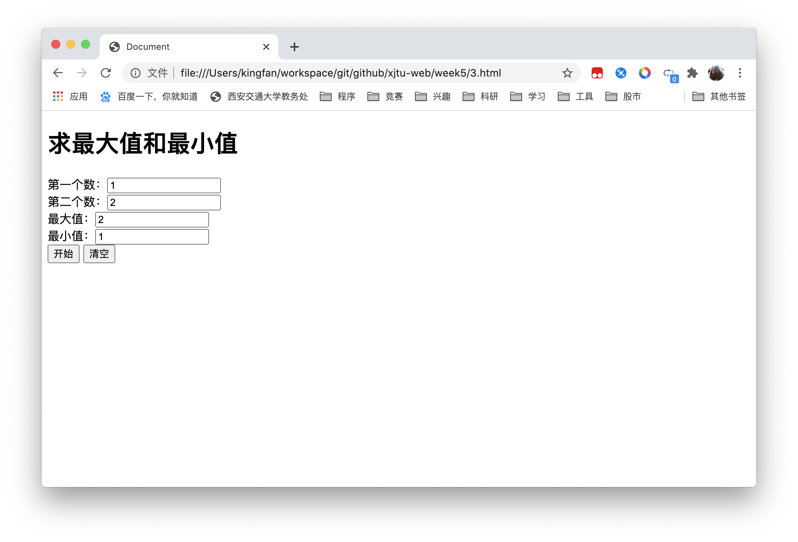
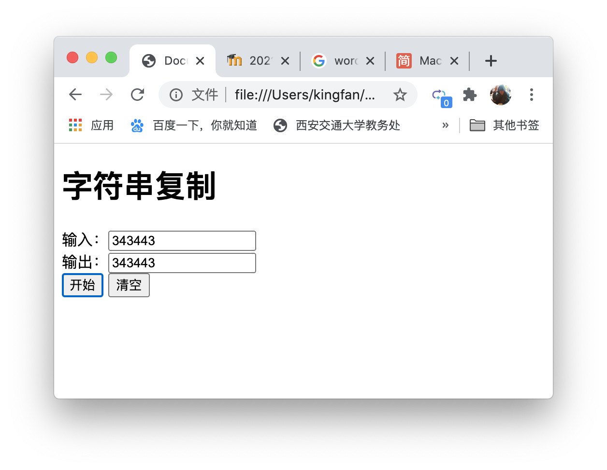

# 《Web程序设计》第5次上机作业

## 创建如下的网页，输入半径值后，单击“计算”按钮，在另外两个文本框中显示面积和周长，单击“清空”按钮，将文本框中内容清除

- 程序代码

```html
<!DOCTYPE html>
<html lang="en">

<head>
  <meta charset="UTF-8">
  <meta name="viewport" content="width=device-width, initial-scale=1.0">
  <title>Document</title>
</head>
<script type="text/javascript">
  function btnClick() {
    var r = parseFloat(document.getElementById("Text1").value);
    var x = document.getElementById("Text2");
    x.value = 2 * Math.PI * r;
    var y = document.getElementById("Text3");
    y.value = Math.PI * r * r;
  }
</script>

<body>
  <h1>圆的面积和周长</h1>
  <form>
    半径：<input id="Text1" type="text" /><br />
    周长：<input id="Text2" type="text" /><br />
    面积：<input id="Text3" type="text" /><br />
    <input id="Button1" type="button" value="计算" onclick="btnClick()" />　
    <input id="Reset1" type="reset" value="重置" />
  </form>
</body>

</html>
```

- 运行结果


## 创建如下的网页，输入学生的信息，单击“提交”按钮后，检查学号长度是否为10位，如果不是，弹出下面的警告框，单击“清空”按钮，将文本框中内容清除。

- 程序代码

```html
<!DOCTYPE html>
<html lang="en">

<head>
  <meta charset="UTF-8">
  <meta name="viewport" content="width=device-width, initial-scale=1.0">
  <title>Document</title>
</head>
<script type="text/javascript">
  function btnClick() {
    var x = document.getElementById("textfield").value;
    if (x.length != 10)
      alert("学号长度应为10位");
    else
      alert("OK");
  }
</script>

<body>
  <h1>个人信息</h1>
  <form id="form1" name="form1" method="post" action="">
    学号：<input type="text" name="textfield" id="textfield" /><br />
    姓名：<input type="text" name="textfield2" id="textfield2" /><br />
    专业：<input type="text" name="textfield3" id="textfield3" /><br />
    <input type="submit" name="button" id="button" value="提交" onclick="btnClick()" />
    <input type="reset" name="button2" id="button2" value="清空" />
    <br />
  </form>
</body>

</html>
```

- 运行结果


## 创建如下的网页，向前两个文本框中输入两个数，单击“开始”按钮后，在后两个文本框中分别显示最大值和最小值，单击“清空”按钮，将文本框中内容清除

```html
<!DOCTYPE html>
<html lang="zh">
<head>
  <meta charset="UTF-8">
  <meta name="viewport" content="width=device-width, initial-scale=1.0">
  <title>Document</title>
</head>

<script type="text/javascript">
  function btnClick() {
    let fir = document.getElementById("textfield").value;
    let sec = document.getElementById("textfield2").value
    document.getElementById("textfield3").value = Math.max(fir, sec)
    document.getElementById("textfield4").value = Math.min(fir, sec)
  }
</script>

<body>
  <h1>求最大值和最小值</h1>
  <form id="form1" name="form1" method="post" action="">
    第一个数：<input type="text" name="textfield" id="textfield" /><br />
    第二个数：<input type="text" name="textfield2" id="textfield2" /><br />
    最大值：<input type="text" name="textfield3" id="textfield3" /><br />
    最小值：<input type="text" name="textfield4" id="textfield4" /><br />
    <input type="button" name="button" id="button" value="开始" onclick="btnClick()" />
    <input type="reset" name="button2" id="button2" value="清空" />
    <br />
  </form>
</body>
</html>
```

- 运行结果



## 创建如下的网页，向一个文本框中输入字符串，单击“开始”按钮后，在后一个文本框中显示相同的内容，单击“清空”按钮，将文本框中内容清除

- 程序代码

```html
<!DOCTYPE html>
<html lang="zh">
<head>
  <meta charset="UTF-8">
  <meta name="viewport" content="width=device-width, initial-scale=1.0">
  <title>Document</title>
</head>

<script type="text/javascript">
  function btnClick() {
    let _str = document.getElementById("textfield").value;
    document.getElementById("textfield2").value = _str
  }
</script>

<body>
  <h1>字符串复制</h1>
  <form id="form1" name="form1" method="post" action="">
    输入：<input type="text" name="textfield" id="textfield" /><br />
    输出：<input type="text" name="textfield2" id="textfield2" /><br />
    <input type="button" name="button" id="button" value="开始" onclick="btnClick()" />
    <input type="reset" name="button2" id="button2" value="清空" />
    <br />
  </form>
</body>
</html>
```

- 运行结果

