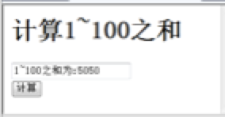
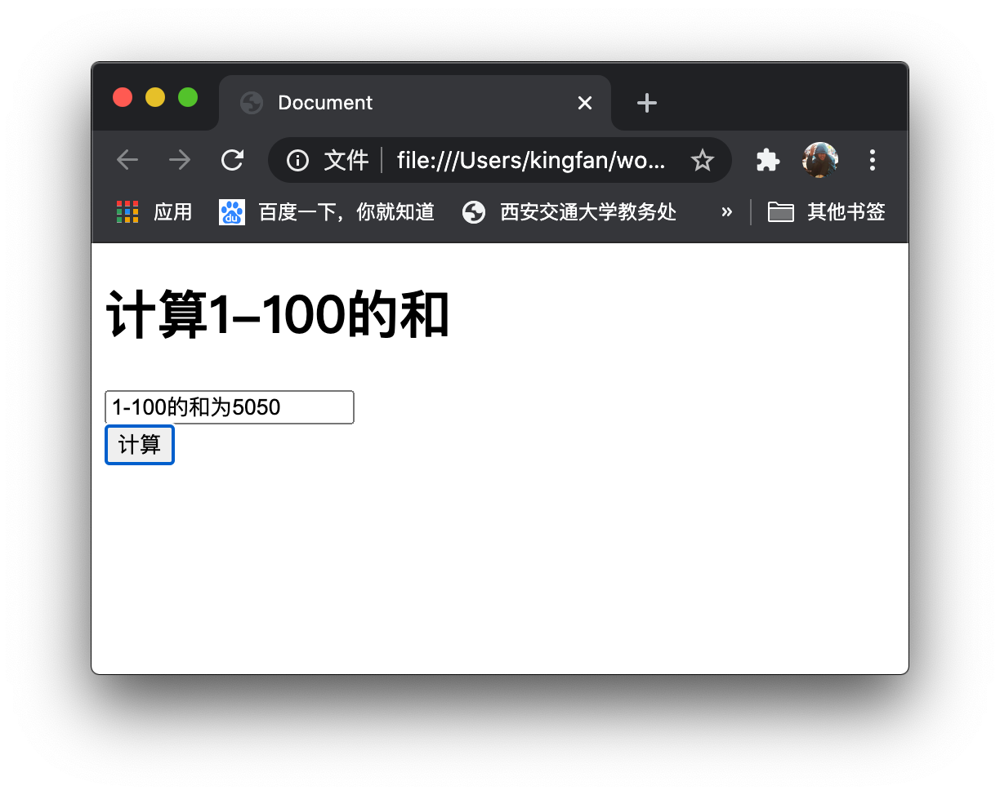
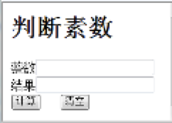
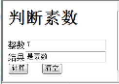
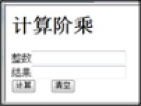
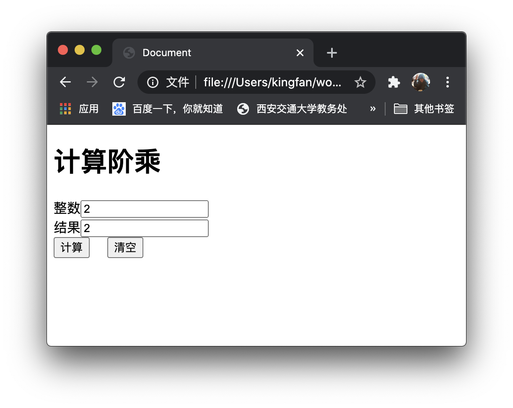
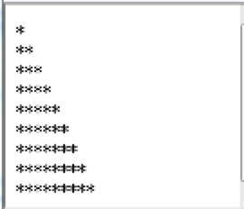
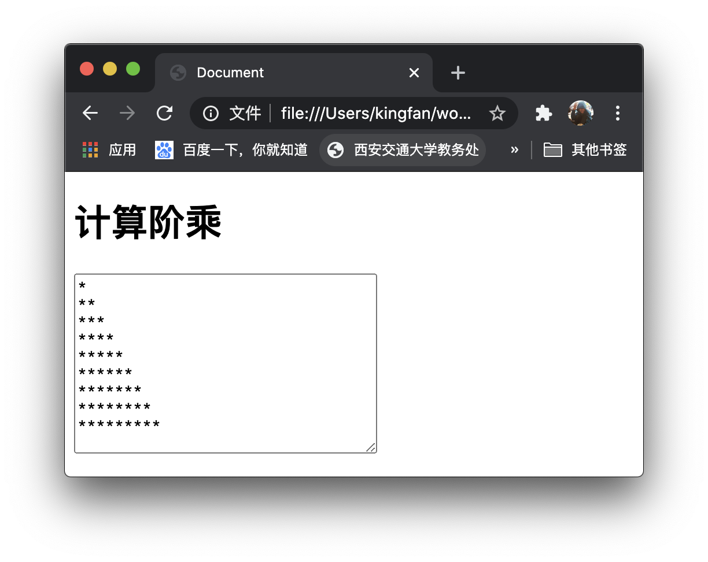

# 《Web程序设计》第6次上机作业

## 创建如下的网页，单击“计算”按钮，在文本框中显示“1-100之和为:5050”，要求使用do-while语句计算



- 程序代码

```html
<!DOCTYPE html>
<html lang="zh">

<head>
  <meta charset="UTF-8">
  <meta name="viewport" content="width=device-width, initial-scale=1.0">
  <title>Document</title>
</head>
<script type="text/javascript">
  function btnClick() {
    var sum = 0
    var i = 0
    do {
      i++
      sum += i
    } while (i < 100);
    document.getElementById("Text1").value = `1-100的和为${sum}`
  }
</script>

<body>
  <h1>计算1-100的和</h1>
  <form>
    <input id="Text1" type="text" /><br />
    <input id="Button1" type="button" value="计算" onclick="btnClick()" />　
  </form>
</body>

</html>
```


- 运行结果



## 创建如下的网页，输入一个整数，单击“计算”按钮后，在另一个文本框中显示判断结果，如右图，单击“清空”按钮，将文本框中内容清除





- 程序代码

```html
<!DOCTYPE html>
<html lang="zh">

<head>
  <meta charset="UTF-8">
  <meta name="viewport" content="width=device-width, initial-scale=1.0">
  <title>Document</title>
</head>
<script type="text/javascript">
  function btnClick() {
    let num = document.getElementById("Text1").value
    document.getElementById("Text2").value = num % 2 == 0 ? '不是素数' : '是素数'
  }
</script>

<body>
  <h1>判断素数</h1>
  <form>
    整数<input id="Text1" type="text" /><br />
    结果<input id="Text2" type="text" /><br />
    <input id="Button1" type="button" value="计算" onclick="btnClick()" />　
    <input type="reset" name="button2" id="button2" value="清空" />
  </form>
</body>

</html>
```

- 运行结果


## 输入一个整数，单击“计算”按钮后，在另一个文本框中显示计算阶乘的结果，单击“清空”按钮，将文本框中内容清除



- 程序代码

```html
<!DOCTYPE html>
<html lang="zh">

<head>
  <meta charset="UTF-8">
  <meta name="viewport" content="width=device-width, initial-scale=1.0">
  <title>Document</title>
</head>
<script type="text/javascript">
  function btnClick() {
    let num = document.getElementById("Text1").value
    let sum = num
    while(num > 1){
      num --
      sum *= num
    }
    document.getElementById("Text2").value = sum
  }
</script>

<body>
  <h1>计算阶乘</h1>
  <form>
    整数<input id="Text1" type="text" /><br />
    结果<input id="Text2" type="text" /><br />
    <input id="Button1" type="button" value="计算" onclick="btnClick()" />　
    <input type="reset" name="button2" id="button2" value="清空" />
  </form>
</body>

</html>
```

- 运行截图



## 设计一段JavaScript 脚本，在网页中显示下面的图案



- 运行代码

```html
<!DOCTYPE html>
<html lang="zh">

<head>
  <meta charset="UTF-8">
  <meta name="viewport" content="width=device-width, initial-scale=1.0">
  <title>Document</title>
</head>
<body>
  <h1>计算阶乘</h1>
  <form>
    <textarea name="text" id="text" cols="30" rows="10"></textarea>
  </form>
</body>

<script type="text/javascript">
  let ch = ''
  let str = ''
  for (let i = 0; i < 9; i++) {
    ch += '*'
    str += `${ch}\n`
  }
  document.getElementById("text").value = str
</script>

</html>
```

- 程序截图

