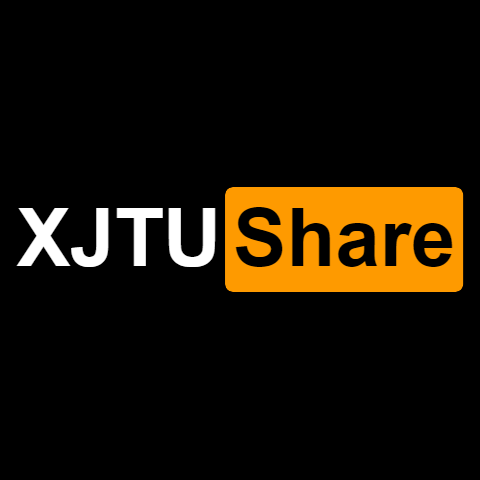

# 西安交通大学课程资料共享计划

  

若github的加载速度较慢，可访问该项目在码云的镜像[gitee.com/cantjie/XJTU-Share](https://gitee.com/cantjie/XJTU-Share)

## 计划初衷与简介

* 本人为西安交通大学2016级信息工程专业的本科生，启动该项目时，本人就读大三。

* 本项目原名为实验报告共享计划。分享实验报告这个想法由来已久，很多时候我写报告的第一个想法是先看看网上有没有类似的实验报告可以参考，尤其是那些验证性、演示性的实验的报告，有时候实验比授课内容超前，如果不进行预习根本无法写实验报告。偶尔能通过学长借到实验报告做参考，但大多数时候，只能在网上搜到过时的、良莠不齐的实验报告作参考，这无助于学生的学习；而第二个促成我想分享的因素是前段时间参加的优秀团员的答辩，答辩中，我发现我的学弟学妹们都十分优秀，和他们比起来，我的大一大二好像虚度了，因此我希望他们不要在有些无意义的实验报告上浪费太多时间，用那些搜索和比较百度文库里面的实验报告的时间做些更想做的事。水涨才能船高。  

* 在2019年10月，项目更名为课程资料共享计划。
* **欢迎各位同学可以贡献包括实验报告在内的一切你认为有用的资料。** 您既可以提pull request，也可以联系我，将资料发送给我，由我来上传。但请确保您拥有上传内容的版权。

* 同时实验报告或其他资料中不可避免会有错误，当您发现其中的错误或失效信息，可以联系作者或直接在平台提issue。

* 上传时请注意，无需对内容进行压缩，请尽量不要上传rar、zip等文件。

* 若要下载单个文件夹，复制该文件夹的网址，粘贴入[DownGit](https://minhaskamal.github.io/DownGit/#/home)中，选择download即可。

------

## 关于文件目录规范

该节规定西安交通大学课程资料共享计划的文件层次、命名标准，以方便更多的贡献者以更统一的标准将信息分享给大家。贡献者不要求实名，也可以选择实名。请尽量确保您所上传的文件不会发生侵权行为。也请注意保护个人隐私信息。

* 根目录为各个课程文件夹，其命名为 编号-名称。
* 各课程文件夹下含有三个文件夹和一个说明文档，文件夹分别为作业、实验、考试。文档写明贡献者希望与同学们分享的相关信息，如课程老师、年份等。如果没有对应资料，如实验课程单独开设，试卷无法公开等情况，请在README.md文档中说明。
* （仅有一个作者时，该层次可省略）在上述子文件夹中创建以作者命名的的文件夹，该文件夹中列出课程相关文件。

以下是一个文件树实例

├─COMP450105-计算机组成  
│  ├─作业  
│  │  ├─作者1  
│  │  └─作者2  
│  ├─实验  
│  ├─试卷  
│  │  ├─作者1  
│  │  └─作者2  
│  └─README.md

------

## 关于版权和证书

* 全部内容版权归属各自的作者。当上传者未指明协议时，遵循以下协议：

[(Creative Commons BY-SA 4.0) 知识共享署名 - 相同方式共享 4.0 国际许可协议](https://creativecommons.org/licenses/by-nc-sa/4.0/deed.zh)

* 资料仅供参考，请自己判断其适用性。

------

## 关于我

开头已经说明，本人为西安交通大学2016级信息工程专业的本科生，启动该项目时，本人就读大三。

我的联系方式：

* QQ：46472001.
* Email:[cantjie@stu.xjtu.edu.cn](mailto:cantjie@stu.xjtu.edu.cn)

------

## 西安交通大学学生违纪处分办法（经2017年8月1日校长办公会议审议通过）（节选）

### 第六条 学生有下列情形之一，学校可以给予开除学籍处分：

* （五）学位论文、公开发表的研究成果存在抄袭、篡改、伪造等学术不端行为，情节严重的，或者代写论文、买卖论文的；
### 第十四条 学生应当自觉维护学校的教学秩序，遵守学校的教学管理规定。扰乱教育教学秩序者，视其情节轻重给予下列处分：
* （五）在公开发表的学术论文、报告、设计中或在提交的学位论文、课程设计、毕业设计中，存在抄袭、篡改、伪造等学术不端行为，情节较轻且认识态度端正者，给予留校察看处分，情节严重者，给予开除学籍处分;
购买、出售或者组织买卖、由他人代写、替他人代写或组织代写学术论文、学位论文、课程设计、毕业设计者，给予开除学籍处分；

------

## 相关工作
- [浙江大学课程攻略共享计划](https://github.com/QSCTech/zju-icicles)
- [北京大学课程资料民间整理](https://github.com/lib-pku/libpku)
- [北大计算机课程大作业](https://github.com/tongtzeho/PKUCourse)
- [清华大学计算机系课程攻略](https://github.com/PKUanonym/REKCARC-TSC-UHT)
- [东南大学课程共享计划](https://github.com/zjdx1998/seucourseshare)
- [中国科学技术大学计算机学院课程资源](https://github.com/USTC-Resource/USTC-Course)
- [西安交通大学课程资料共享计划](https://github.com/cantjie/XJTU-Share)
- [上海交通大学课程资料分享](https://github.com/CoolPhilChen/SJTU-Courses/)
- [中山大学课程资料分享](https://github.com/sysuexam/SYSU-Exam)
- [南京大学课程复习资料](https://github.com/idealclover/NJU-Review-Materials)
- [郑州大学课程复习资料](https://github.com/CooperNiu/ZZU-Courses-Resource)
